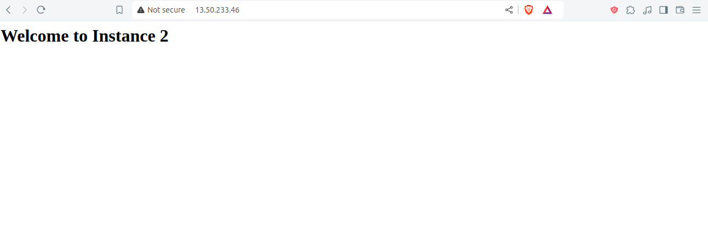
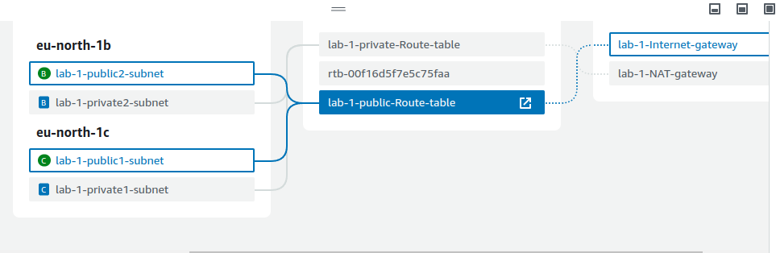
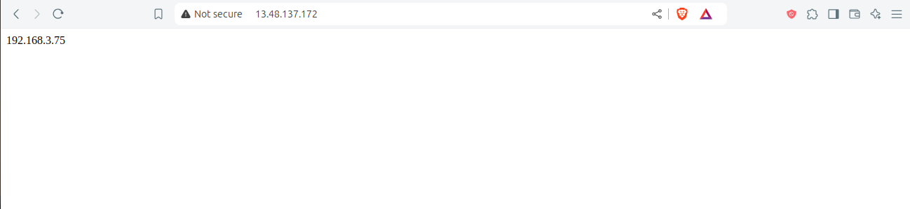

# AWS-EC2-Public-and-Private-Load-Balancer


## Overview

This lab demonstrates how to set up a Virtual Private Cloud (VPC) on AWS, including creating subnets, configuring an internet gateway, and deploying EC2 instances with a load balancer.

## Stages

1. **Stage 1**: Set up a VPC with public subnets, configure internet access, and deploy EC2 instances with Nginx and a load balancer.
2. **Stage 2**: Create private subnets and configure routing for internet access through public subnets.

## Prerequisites

- AWS account.
- Basic knowledge of AWS services such as VPC, EC2, and Load Balancer.

## Installation and Setup

### Stage 1: Initial Setup

#### 1. Create a VPC

- Open the [VPC Dashboard](https://console.aws.amazon.com/vpc/home).
- Create a new VPC with the CIDR block `192.168.0.0/16`.

  

#### 2. Create Subnets

- Go to the **"Subnets"** section.
- Create:
  - Subnet 1: `192.168.1.0/24`
  - Subnet 2: `192.168.2.0/24`

  

#### 3. Configure Internet Access

- Go to **"Internet Gateways"**.
- Create and attach an Internet Gateway to your VPC.
- Update the route table to route traffic to the Internet Gateway.

  
  

#### 4. Launch EC2 Instances

- **Instance 1**: Launch an EC2 instance in subnet `192.168.1.0/24` and install Nginx.
- **Instance 2**: Launch an EC2 instance in subnet `192.168.2.0/24` and install Nginx.
- **Instance 3 (Load Balancer)**: Launch an EC2 instance in either subnet and configure it as a load balancer.

#### 5. Configure Nginx (Instance 1 and Instance 2)

On each Nginx instance, run:

```linux 
#!/bin/bash

# Move to /tmp directory
cd /tmp

# Install the SSM Agent
sudo yum install -y https://s3.amazonaws.com/ec2-downloads-windows/SSMAgent/latest/linux_amd64/amazon-ssm-agent.rpm

# Enable and start the SSM Agent
sudo systemctl enable amazon-ssm-agent
sudo systemctl start amazon-ssm-agent

# Install Nginx
sudo yum install -y nginx

# Create a simple HTML file

echo "<html><body> <h1> Welcome to Instance 1 (or 2) </h1></body></html>" | sudo tee /usr/share/nginx/html/index.html

# Start Nginx service
sudo systemctl start nginx
```
#### 5. Configure Nginx (Instance 3 )
Once Nginx is installed, we need to configure it as a load balancer. We do this by creating a configuration file for Nginx. Create the configuration file at */etc/nginx/conf.d* and name it as *lb.conf* . Add the following code to the configuration file:

```nginx
upstream backend {
    server <IP_ADDRESS_1>;
    server <IP_ADDRESS_2>;
    # add more backend servers as needed
}

server {
    listen 80;
    server_name <LOAD_BALANCER_IP_ADDRESS>;

    location / {
        proxy_pass http://backend;
    }
}
```
#### 6.Load Balancer Overview

 
 

### Stage 2: Private EC2 Instances and Load Balancing

#### 1. Create Private Subnets

- In the **"Subnets"** section, create two private subnets:
  - Private Subnet 1: `192.168.3.0/24`
  - Private Subnet 2: `192.168.4.0/24`
#### 2. Configure Internet Access

- Go to **"NAT Gateways"**.
- Create and attach an NAT Gateway to your VPC.
- Update the route table to route traffic to the Internet Gateway.
  
#### 3. Launch EC2 Instances

- **Instance 1 (Public Load Balancer)**: Launch an EC2 instance in Public Subnet and configure it as a load balancer.
- **Instance 2 ,3 (Public EC2 Instance)**: Launch an EC2 instance in Public Subnet and install Nginx.
- **Instance 4 (Private Load Balancer)**: Launch an EC2 instance in Private Subnet and configure it as a load balancer.
- **Instance 5,6 (Private EC2 Instance)**: Launch an EC2 instance in Private Subnet and install Nginx.
#### 4.Configure Nginx on the public EC2 Instance 2,3
```nginx
upstream backend {
    server <PRIVATE_LOAD_BALANCER_IP_ADDRESS>; 
    # add more backend servers as needed
}

server {
    listen 80;
    server_name <Public_Instance_IP_ADDRESS>;

    location / {
        proxy_pass http://backend;
    }
}
```
#### 5.Configure Nginx on the Private Load Balancer
```nginx
upstream backend {
    server <PRIVATE_IP_ADDRESS_1>;
    server <PRIVATE_IP_ADDRESS_2>;
    # add more backend servers as needed
}

server {
    listen 80;
    server_name <PRIVATE_LOAD_BALANCER_IP_ADDRESS>;

    location / {
        proxy_pass http://backend;
    }
}
```
#### 6. Configure Nginx on the Private EC2 Instance

On the private EC2 instance in Private Subnet (Instance 5,6), run the following commands to display the local IPv4 address on a web page:

```bash

TOKEN=$(curl -X PUT "http://169.254.169.254/latest/api/token" -H "X-aws-ec2-metadata-token-ttl-seconds: 21600")
curl -H "X-aws-ec2-metadata-token: $TOKEN" http://169.254.169.254/latest/meta-data/local-ipv4 > /usr/share/nginx/html/index.html
```
#### 7.Overview of Private EC2 Instance



