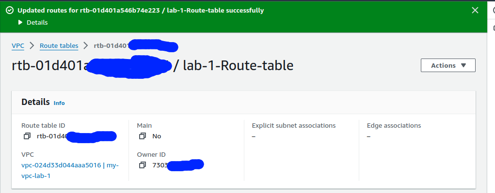

# AWS VPC and Load Balancer Lab

## Overview

This lab demonstrates how to set up a Virtual Private Cloud (VPC) on AWS, including creating subnets, configuring an internet gateway, and deploying EC2 instances with a load balancer.

## Stages

1. **Stage 1**: Set up a VPC with public subnets, configure internet access, and deploy EC2 instances with Nginx and a load balancer.
2. **Stage 2**: Create private subnets and configure routing for internet access through public subnets.

## Prerequisites

- AWS account.
- Basic knowledge of AWS services such as VPC, EC2, and Load Balancer.

## Installation and Setup

### Stage 1: Initial Setup

#### 1. Create a VPC

- Open the [VPC Dashboard](https://console.aws.amazon.com/vpc/home).
- Create a new VPC with the CIDR block `192.168.0.0/16`.

  

#### 2. Create Subnets

- Go to the **"Subnets"** section.
- Create:
  - Subnet 1: `192.168.1.0/24`
  - Subnet 2: `192.168.2.0/24`

  

#### 3. Configure Internet Access

- Go to **"Internet Gateways"**.
- Create and attach an Internet Gateway to your VPC.
- Update the route table to route traffic to the Internet Gateway.

  
  

#### 4. Launch EC2 Instances

- **Instance 1**: Launch an EC2 instance in subnet `192.168.1.0/24` and install Nginx.
- **Instance 2**: Launch an EC2 instance in subnet `192.168.2.0/24` and install Nginx.
- **Instance 3 (Load Balancer)**: Launch an EC2 instance in either subnet and configure it as a load balancer.

#### 5. Configure Nginx (Instance 1 and Instance 2)

On each Nginx instance, run:

\#!/bin/bash

\# Move to /tmp directory
cd /tmp

\# Install the SSM Agent
sudo yum install -y https://s3.amazonaws.com/ec2-downloads-windows/SSMAgent/latest/linux_amd64/amazon-ssm-agent.rpm

\# Enable and start the SSM Agent
sudo systemctl enable amazon-ssm-agent
sudo systemctl start amazon-ssm-agent

\# Install Nginx
sudo yum install -y nginx

\# Create a simple HTML file
echo "<html><body><h1> Welcome to Instance 1 (for seond ec2 use 2) </h1></body></html>" | sudo tee /var/www/html/index.html

\# Start Nginx service
sudo systemctl start nginx

#### 5. Configure Nginx (Instance 3 )

upstream backend {
        server <IP_ADDRESS_1>;
        server <IP_ADDRESS_2>;
        # add more backend servers as needed
    }

    server {
        listen 80;
        server_name http://<LOAD_BALANCER_IP_ADDRESS>;

        location / {
            proxy_pass http://backend;
        }
    }
